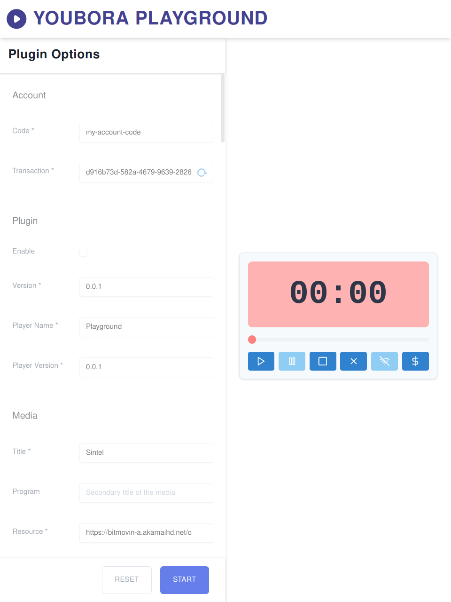
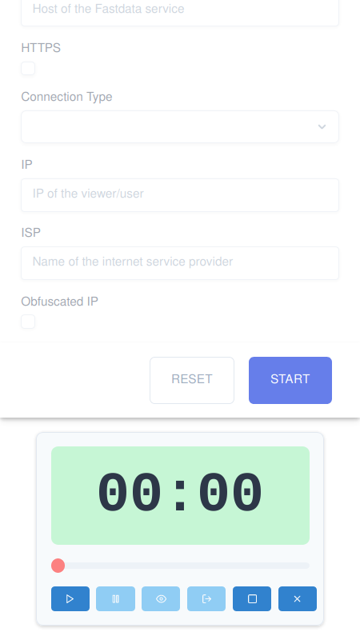

# Youbora Playground

Test youbora library options and behaviours in a controlled environment

## Visuals

### Large devices

### Medium Devices

### Small Devices

## Installation

Execute `yarn install`

## Usage

1. Execute `yarn start`
1. Open the address `http://localhost:1234`

## License

[MIT](https://choosealicense.com/licenses/mit/)